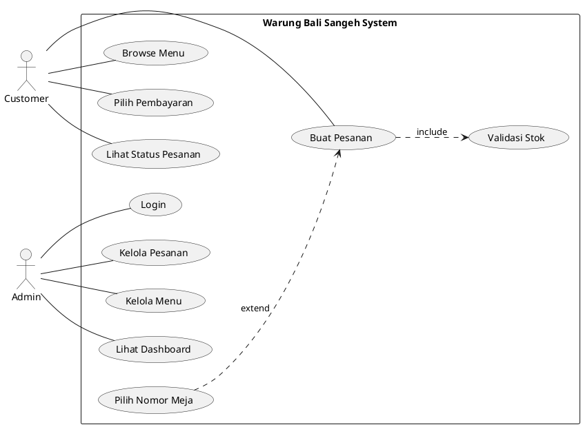
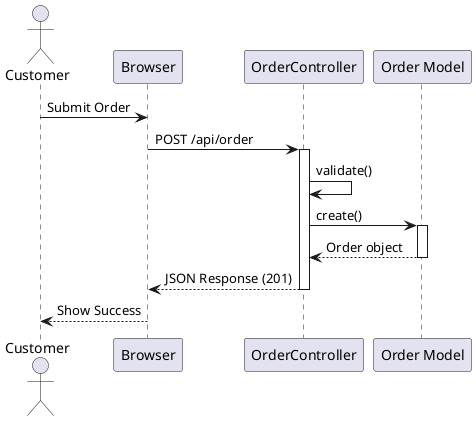
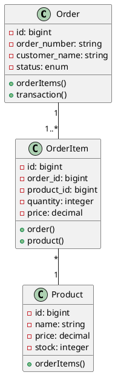

# 📊 Warung Bali Sangeh - Object Oriented Analysis & Design

## Daftar Isi
1. [Overview Sistem](#overview-sistem)
2. [Use Case Diagram](#use-case-diagram)
3. [Activity Diagram](#activity-diagram)
4. [Sequence Diagram](#sequence-diagram)
5. [Class Diagram](#class-diagram)
6. [Entity Relationship Diagram](#entity-relationship-diagram)
7. [State Diagram](#state-diagram)

---

## Overview Sistem

**Warung Bali Sangeh Order System** adalah aplikasi pemesanan makanan berbasis web untuk restoran. Sistem ini memiliki dua sisi:
- **Customer Side**: Untuk pelanggan memesan makanan (dine-in atau takeaway)
- **Admin Side**: Untuk admin mengelola pesanan, menu, dan melihat statistik

### Teknologi Stack
- **Backend**: Laravel 11 (PHP)
- **Frontend**: Blade Template, Vanilla JavaScript
- **Database**: MySQL/PostgreSQL
- **Authentication**: Session-based

### Fitur Utama
1. **Customer**: Browse menu, buat pesanan, pilih metode pembayaran, tracking pesanan
2. **Admin**: Login, dashboard statistik, kelola pesanan, kelola menu/stok, pengaturan tema

---

## Use Case Diagram

### Aktor
- **Customer (Pelanggan)**: User yang memesan makanan
- **Admin**: Staff restoran yang mengelola sistem
- **Cashier**: Admin dengan role khusus kasir

### Use Cases

```
┌─────────────────────────────────────────────────────────────┐
│                    WARUNG BALI SANGEH SYSTEM                 │
├─────────────────────────────────────────────────────────────┤
│                                                               │
│  ┌────────────┐                                              │
│  │  Customer  │                                              │
│  └─────┬──────┘                                              │
│        │                                                      │
│        ├──────> Pilih Mode Pemesanan                        │
│        │        (Dine-in / Takeaway)                         │
│        │                                                      │
│        ├──────> Browse Menu                                  │
│        │        └─> Lihat Kategori Produk                   │
│        │        └─> Lihat Detail Produk                     │
│        │                                                      │
│        ├──────> Kelola Keranjang                            │
│        │        └─> Tambah Item ke Keranjang               │
│        │        └─> Ubah Quantity Item                      │
│        │        └─> Hapus Item dari Keranjang              │
│        │                                                      │
│        ├──────> Buat Pesanan                                 │
│        │        └─> Input Data Pelanggan                    │
│        │        └─> Pilih Nomor Meja (Dine-in)             │
│        │        └─> Tambah Catatan Pesanan                  │
│        │                                                      │
│        ├──────> Pilih Metode Pembayaran                     │
│        │        └─> Bayar di Kasir                          │
│        │        └─> Bayar via QRIS                          │
│        │                                                      │
│        └──────> Lihat Status Pesanan                         │
│                 └─> Tracking Real-time                       │
│                                                               │
│  ┌────────────┐                                              │
│  │   Admin    │                                              │
│  └─────┬──────┘                                              │
│        │                                                      │
│        ├──────> Login ke Admin Panel                         │
│        │        └─> Validasi Kredensial                     │
│        │                                                      │
│        ├──────> Lihat Dashboard                              │
│        │        └─> Statistik Pendapatan                    │
│        │        └─> Statistik Pesanan Aktif                 │
│        │        └─> Produk Terlaris                         │
│        │        └─> Daftar Pesanan Terbaru                  │
│        │                                                      │
│        ├──────> Kelola Pesanan                               │
│        │        └─> Lihat Daftar Pesanan                    │
│        │        └─> Filter Pesanan                          │
│        │        └─> Lihat Detail Pesanan                    │
│        │        └─> Update Status Pesanan                   │
│        │            (Pending → Preparing → Ready →          │
│        │             Completed / Cancelled)                  │
│        │                                                      │
│        ├──────> Kelola Menu & Stok                           │
│        │        └─> Lihat Daftar Produk                     │
│        │        └─> Lihat Statistik Penjualan Produk       │
│        │        └─> Monitor Stok Produk                     │
│        │        └─> Alert Stok Rendah                       │
│        │                                                      │
│        ├──────> Kasir Mode                                   │
│        │        └─> Terima Pembayaran Tunai                 │
│        │        └─> Verifikasi Pembayaran                   │
│        │                                                      │
│        ├──────> Pengaturan Sistem                            │
│        │        └─> Ubah Tema Warna                         │
│        │        └─> Toggle Dark/Light Mode                  │
│        │                                                      │
│        └──────> Logout                                        │
│                                                               │
└─────────────────────────────────────────────────────────────┘
```

### Use Case Descriptions

#### UC-01: Buat Pesanan (Customer)
- **Aktor**: Customer
- **Precondition**: Customer telah memilih mode pemesanan dan menambahkan item ke keranjang
- **Flow**:
  1. Customer mengisi nama
  2. Customer menambahkan nomor meja (jika dine-in)
  3. Customer menambahkan catatan pesanan (opsional)
  4. Sistem generate order number otomatis
  5. Sistem validasi data pesanan
  6. Sistem cek ketersediaan stok
  7. Sistem kurangi stok produk
  8. Sistem simpan pesanan dengan status "pending"
  9. Sistem redirect ke halaman pembayaran
- **Postcondition**: Pesanan tersimpan di database, stok produk berkurang

#### UC-02: Update Status Pesanan (Admin)
- **Aktor**: Admin
- **Precondition**: Admin sudah login dan melihat daftar pesanan
- **Flow**:
  1. Admin pilih pesanan yang akan diupdate
  2. Admin lihat detail pesanan
  3. Admin ubah status pesanan
  4. Sistem validasi status transition
  5. Sistem update status pesanan
  6. Sistem tampilkan notifikasi sukses
- **Postcondition**: Status pesanan berubah di database

---

## Activity Diagram

### 1. Activity Diagram: Customer Order Process

```
                        [START]
                           |
                           v
                  ┌────────────────┐
                  │ Pilih Mode     │
                  │ Order          │
                  │ (Dine-in/      │
                  │  Takeaway)     │
                  └────────┬───────┘
                           |
                           v
                  ┌────────────────┐
                  │ Browse Menu    │
                  │ by Category    │
                  └────────┬───────┘
                           |
                           v
                  ┌────────────────┐
                  │ Pilih Produk   │
                  │ & Quantity     │
                  └────────┬───────┘
                           |
                           v
                  ┌────────────────┐
                  │ Tambah ke      │
                  │ Keranjang      │
                  └────────┬───────┘
                           |
                           v
                    ◇───────────◇
                  /Selesai belanja?\
                 /                  \
           [Tidak]                [Ya]
                |                    |
                v                    v
        [Kembali ke Menu]    ┌────────────────┐
                             │ Review Cart    │
                             │ & Total        │
                             └────────┬───────┘
                                      |
                                      v
                             ┌────────────────┐
                             │ Input Nama     │
                             │ Customer       │
                             └────────┬───────┘
                                      |
                                      v
                              ◇──────────◇
                            /Dine-in?      \
                           /                \
                     [Ya]                   [Tidak]
                        |                      |
                        v                      |
              ┌────────────────┐               |
              │ Input Nomor    │               |
              │ Meja           │               |
              └────────┬───────┘               |
                       |                       |
                       └───────┬───────────────┘
                               |
                               v
                      ┌────────────────┐
                      │ Tambah Catatan │
                      │ (Optional)     │
                      └────────┬───────┘
                               |
                               v
                      ┌────────────────┐
                      │ Submit Order   │
                      └────────┬───────┘
                               |
                               v
                      ┌────────────────┐
                      │ SISTEM:        │
                      │ Validasi Data  │
                      └────────┬───────┘
                               |
                               v
                        ◇──────────◇
                      /Valid?        \
                     /                \
               [Tidak]                [Ya]
                    |                  |
                    v                  v
          [Tampilkan Error]   ┌────────────────┐
                    |         │ SISTEM:        │
                    |         │ Cek Stok       │
                    |         │ Produk         │
                    |         └────────┬───────┘
                    |                  |
                    |                  v
                    |          ◇──────────◇
                    |        /Stok cukup?   \
                    |       /                \
                    |  [Tidak]              [Ya]
                    |      |                  |
                    |      v                  v
                    |  [Tampilkan      ┌────────────────┐
                    |   Stok Habis]    │ SISTEM:        │
                    |                  │ Kurangi Stok   │
                    |                  └────────┬───────┘
                    |                           |
                    |                           v
                    |                  ┌────────────────┐
                    |                  │ SISTEM:        │
                    |                  │ Simpan Order   │
                    |                  │ (Status:       │
                    |                  │  Pending)      │
                    |                  └────────┬───────┘
                    |                           |
                    └───────────────────────────┘
                                                |
                                                v
                                       ┌────────────────┐
                                       │ Redirect ke    │
                                       │ Payment Page   │
                                       └────────┬───────┘
                                                |
                                                v
                                       ┌────────────────┐
                                       │ Pilih Metode   │
                                       │ Pembayaran     │
                                       └────────┬───────┘
                                                |
                                                v
                                         ◇──────────◇
                                       /Metode?       \
                                      /                \
                              [Kasir]                [QRIS]
                                   |                    |
                                   v                    v
                          ┌────────────────┐   ┌────────────────┐
                          │ Konfirmasi     │   │ Tampilkan      │
                          │ Bayar di Kasir │   │ QR Code        │
                          └────────┬───────┘   └────────┬───────┘
                                   |                    |
                                   └──────┬─────────────┘
                                          |
                                          v
                                 ┌────────────────┐
                                 │ Tampilkan      │
                                 │ Order Success  │
                                 │ + Order Number │
                                 └────────┬───────┘
                                          |
                                          v
                                       [END]
```

### 2. Activity Diagram: Admin Update Order Status

```
                        [START]
                           |
                           v
                  ┌────────────────┐
                  │ Login ke       │
                  │ Admin Panel    │
                  └────────┬───────┘
                           |
                           v
                  ┌────────────────┐
                  │ Navigasi ke    │
                  │ Orders Page    │
                  └────────┬───────┘
                           |
                           v
                  ┌────────────────┐
                  │ Lihat Daftar   │
                  │ Pesanan        │
                  └────────┬───────┘
                           |
                           v
                  ┌────────────────┐
                  │ Filter Pesanan │
                  │ (Optional)     │
                  │ - Status       │
                  │ - Type         │
                  │ - Date         │
                  └────────┬───────┘
                           |
                           v
                  ┌────────────────┐
                  │ Pilih Pesanan  │
                  │ yang akan      │
                  │ diupdate       │
                  └────────┬───────┘
                           |
                           v
                  ┌────────────────┐
                  │ Lihat Detail   │
                  │ Pesanan        │
                  │ - Items        │
                  │ - Customer     │
                  │ - Total        │
                  └────────┬───────┘
                           |
                           v
                  ┌────────────────┐
                  │ Ubah Status    │
                  │ Pesanan        │
                  └────────┬───────┘
                           |
                           v
                  ┌────────────────┐
                  │ SISTEM:        │
                  │ Validasi       │
                  │ Status         │
                  └────────┬───────┘
                           |
                           v
                    ◇───────────◇
                  /Valid?         \
                 /                 \
           [Tidak]               [Ya]
                |                  |
                v                  v
       [Tampilkan Error]  ┌────────────────┐
                |         │ SISTEM:        │
                |         │ Update Status  │
                |         │ di Database    │
                |         └────────┬───────┘
                |                  |
                |                  v
                |         ┌────────────────┐
                |         │ SISTEM:        │
                |         │ Tampilkan      │
                |         │ Success        │
                |         │ Notification   │
                |         └────────┬───────┘
                |                  |
                └──────────────────┘
                                   |
                                   v
                          ┌────────────────┐
                          │ Refresh        │
                          │ Order List     │
                          └────────┬───────┘
                                   |
                                   v
                                [END]
```

---

## Sequence Diagram

### 1. Sequence Diagram: Create Order Process

```
Customer      Browser       OrderController    StoreOrderRequest    Order Model    Product Model    OrderItem Model
   |             |                 |                   |                 |               |                 |
   |--Submit---->|                 |                   |                 |               |                 |
   |   Order     |                 |                   |                 |               |                 |
   |             |                 |                   |                 |               |                 |
   |             |--POST /api/---->|                   |                 |               |                 |
   |             |   order         |                   |                 |               |                 |
   |             |                 |                   |                 |               |                 |
   |             |                 |--validate()------>|                 |               |                 |
   |             |                 |                   |                 |               |                 |
   |             |                 |<--validated data--|                 |               |                 |
   |             |                 |                   |                 |               |                 |
   |             |                 |--create()----------------------->|               |                 |
   |             |                 |   (order_number,                  |               |                 |
   |             |                 |    customer_name,                 |               |                 |
   |             |                 |    order_type,                    |               |                 |
   |             |                 |    total_amount,                  |               |                 |
   |             |                 |    status='pending')              |               |                 |
   |             |                 |                                   |               |                 |
   |             |                 |<--Order object--------------------|               |                 |
   |             |                 |                   |                 |               |                 |
   |             |                 |--whereIn()---------------------------|----------->|                 |
   |             |                 |   (product names)                     |            |                 |
   |             |                 |                                       |            |                 |
   |             |                 |<--Products collection-----------------|-----------.|                 |
   |             |                 |                   |                 |               |                 |
   |             |                 |--Loop through items                 |               |                 |
   |             |                 |  {                                  |               |                 |
   |             |                 |    Check stock                      |               |                 |
   |             |                 |    If insufficient:                 |               |                 |
   |             |                 |      return 400 error               |               |                 |
   |             |                 |  }                                  |               |                 |
   |             |                 |                   |                 |               |                 |
   |             |                 |--Loop through items                 |               |                 |
   |             |                 |  {                                  |               |                 |
   |             |                 |--orderItems()->create()-------------|---------------|------------->|
   |             |                 |   (product_id,                      |               |               |
   |             |                 |    quantity,                        |               |               |
   |             |                 |    price,                           |               |               |
   |             |                 |    subtotal)                        |               |               |
   |             |                 |                                     |               |               |
   |             |                 |<--OrderItem object------------------|---------------|---------------|
   |             |                 |                   |                 |               |                 |
   |             |                 |--find()->decrement()----------------|------------->|                 |
   |             |                 |   (stock, quantity)                 |               |                 |
   |             |                 |  }                                  |               |                 |
   |             |                 |                   |                 |               |                 |
   |             |<--JSON Response-|                   |                 |               |                 |
   |             |   (201 Created, |                   |                 |               |                 |
   |             |    order data)  |                   |                 |               |                 |
   |             |                 |                   |                 |               |                 |
   |<--Display---|                 |                   |                 |               |                 |
   |   Success   |                 |                   |                 |               |                 |
   |             |                 |                   |                 |               |                 |
```

### 2. Sequence Diagram: Admin Login Process

```
Admin       Browser       AdminController    Admin Model    Session
   |            |                |                |            |
   |--Enter----->|                |                |            |
   |  Credentials|                |                |            |
   |            |                |                |            |
   |            |--POST /login-->|                |            |
   |            |                |                |            |
   |            |                |--validate()    |            |
   |            |                |   (email,      |            |
   |            |                |    password)   |            |
   |            |                |                |            |
   |            |                |--where('email')----------->|
   |            |                |                |            |
   |            |                |<--Admin object-------------|
   |            |                |                |            |
   |            |                |--Hash::check() |            |
   |            |                |   (password)   |            |
   |            |                |                |            |
   |            |                |--[if valid]    |            |
   |            |                |                |            |
   |            |                |--session()->put()--------->|
   |            |                |   (admin_logged_in,        |
   |            |                |    admin_id,               |
   |            |                |    admin_name,             |
   |            |                |    admin_email)            |
   |            |                |                |            |
   |            |<--Redirect-----|                |            |
   |            |   to Dashboard |                |            |
   |            |                |                |            |
   |<--Show------|                |                |            |
   |  Dashboard  |                |                |            |
   |            |                |                |            |
```

### 3. Sequence Diagram: Update Order Status

```
Admin      Browser      AdminController   UpdateOrderStatusRequest   Order Model
   |           |               |                    |                    |
   |--Click--->|               |                    |                    |
   |  Update   |               |                    |                    |
   |  Status   |               |                    |                    |
   |           |               |                    |                    |
   |           |--PUT /api/--->|                    |                    |
   |           |   admin/      |                    |                    |
   |           |   orders/{id}/|                    |                    |
   |           |   status      |                    |                    |
   |           |               |                    |                    |
   |           |               |--validate()------->|                    |
   |           |               |                    |                    |
   |           |               |<--validated data---|                    |
   |           |               |                    |                    |
   |           |               |--where('order_number')---------------->|
   |           |               |   ->firstOrFail()                      |
   |           |               |                    |                    |
   |           |               |<--Order object-------------------------|
   |           |               |                    |                    |
   |           |               |--update(status)-----------------------|
   |           |               |                    |                    |
   |           |               |<--Updated order------------------------|
   |           |               |                    |                    |
   |           |<--JSON Response                    |                    |
   |           |   (200 OK,    |                    |                    |
   |           |    success msg)|                    |                    |
   |           |               |                    |                    |
   |<--Update--|               |                    |                    |
   |    UI     |               |                    |                    |
   |           |               |                    |                    |
```

### 4. Sequence Diagram: View Order Detail

```
Customer/Admin   Browser      OrderController    Order Model    OrderItem Model    Product Model
      |             |                |                |                |                 |
      |--Request--->|                |                |                |                 |
      |   Order     |                |                |                |                 |
      |   Detail    |                |                |                |                 |
      |             |                |                |                |                 |
      |             |--GET /api/---->|                |                |                 |
      |             |   order/{id}   |                |                |                 |
      |             |                |                |                |                 |
      |             |                |--where()------>|                |                 |
      |             |                |   ('order_     |                |                 |
      |             |                |    number')    |                |                 |
      |             |                |                |                |                 |
      |             |                |--with()--------|--------------->|                 |
      |             |                |   ['orderItems.|                |                 |
      |             |                |    product']   |                |                 |
      |             |                |                |                |                 |
      |             |                |                |--Load products----------------->|
      |             |                |                |                |                 |
      |             |                |                |<--Products data----------------|
      |             |                |                |                |                 |
      |             |                |<--Order with---|----------------|                 |
      |             |                |   items & prods|                |                 |
      |             |                |                |                |                 |
      |             |<--JSON Response|                |                |                 |
      |             |   (order data  |                |                |                 |
      |             |    with items) |                |                |                 |
      |             |                |                |                |                 |
      |<--Display---|                |                |                |                 |
      |   Order     |                |                |                |                 |
      |   Details   |                |                |                |                 |
      |             |                |                |                |                 |
```


---

## Class Diagram

```
┌─────────────────────────────────────────────────────────────────────────────────────┐
│                              CLASS DIAGRAM                                           │
└─────────────────────────────────────────────────────────────────────────────────────┘

┌──────────────────────────┐
│       User               │
├──────────────────────────┤
│ - id: bigint            │
│ - name: string          │
│ - email: string         │
│ - password: string      │
│ - phone: string         │
│ - email_verified_at     │
│ - remember_token        │
│ - created_at            │
│ - updated_at            │
├──────────────────────────┤
│ + orders()              │
└──────────────────────────┘
         │
         │ 1
         │
         │ has many
         │
         │ 0..*
         ▼
┌──────────────────────────┐         ┌──────────────────────────┐
│       Order              │         │      Transaction         │
├──────────────────────────┤         ├──────────────────────────┤
│ - id: bigint            │◄────────│ - id: bigint            │
│ - order_number: string  │  1   1  │ - order_id: bigint      │
│ - user_id: bigint       │         │ - transaction_number    │
│ - customer_name: string │         │ - payment_method: enum  │
│ - customer_phone: string│         │   (cash, qris, transfer)│
│ - order_type: enum      │         │ - payment_status: enum  │
│   (dinein, takeaway)    │         │   (pending, paid, failed│
│ - table_number: string  │         │ - amount: decimal       │
│ - discount: decimal     │         │ - notes: text           │
│ - total_amount: decimal │         │ - created_at            │
│ - status: enum          │         │ - updated_at            │
│   (pending, preparing,  │         ├──────────────────────────┤
│    ready, completed,    │         │ + order()               │
│    cancelled)           │         └──────────────────────────┘
│ - notes: text           │
│ - created_at            │
│ - updated_at            │
├──────────────────────────┤
│ + user()                │
│ + orderItems()          │
│ + transaction()         │
└──────────────────────────┘
         │
         │ 1
         │
         │ has many
         │
         │ 1..*
         ▼
┌──────────────────────────┐
│      OrderItem           │
├──────────────────────────┤
│ - id: bigint            │
│ - order_id: bigint      │◄──────────┐
│ - product_id: bigint    │           │
│ - product_name: string  │           │
│ - quantity: integer     │           │
│ - price: decimal        │           │
│ - subtotal: decimal     │           │
│ - notes: text           │           │
│ - created_at            │           │
│ - updated_at            │           │
├──────────────────────────┤           │
│ + order()               │           │
│ + product()             │           │ many
└──────────────────────────┘           │
         │                             │
         │ many                        │
         │                             │
         │ belongs to                  │
         │                             │
         │ 1                           │
         ▼                             │
┌──────────────────────────┐           │
│       Product            │           │
├──────────────────────────┤           │
│ - id: bigint            │           │
│ - category_id: bigint   │           │
│ - name: string          │           │
│ - price: decimal        │           │
│ - stock: integer        │           │
│ - created_at            │           │
│ - updated_at            │           │
├──────────────────────────┤           │
│ + category()            │           │
│ + orderItems()          │───────────┘
│ + decrement(stock)      │
└──────────────────────────┘
         │
         │ many
         │
         │ belongs to
         │
         │ 1
         ▼
┌──────────────────────────┐
│      Category            │
├──────────────────────────┤
│ - id: bigint            │
│ - name: string          │
│ - created_at            │
│ - updated_at            │
├──────────────────────────┤
│ + products()            │
└──────────────────────────┘


┌──────────────────────────┐
│        Admin             │
├──────────────────────────┤
│ - id: bigint            │
│ - name: string          │
│ - email: string         │
│ - password: string      │
│ - role: string          │
│   (admin, cashier, etc) │
│ - is_active: boolean    │
│ - remember_token        │
│ - created_at            │
│ - updated_at            │
├──────────────────────────┤
│ (No relations)          │
└──────────────────────────┘


┌────────────────────────────────────────────────────────┐
│              CONTROLLER CLASSES                         │
├────────────────────────────────────────────────────────┤
│                                                         │
│  ┌──────────────────────────┐                          │
│  │   OrderController        │                          │
│  ├──────────────────────────┤                          │
│  │ + store(request)         │ ◄─── StoreOrderRequest  │
│  │ + show(orderNumber)      │                          │
│  │ + update(request, id)    │                          │
│  │ + destroy(orderNumber)   │                          │
│  └──────────────────────────┘                          │
│                                                         │
│  ┌──────────────────────────┐                          │
│  │   AdminController        │                          │
│  ├──────────────────────────┤                          │
│  │ + showLogin()            │                          │
│  │ + login(request)         │                          │
│  │ + logout()               │                          │
│  │ + dashboard()            │                          │
│  │ + cashier()              │                          │
│  │ + orders(request)        │                          │
│  │ + menu()                 │                          │
│  │ + settings()             │                          │
│  │ + updateSettings(req)    │                          │
│  │ + getOrderDetail(id)     │                          │
│  │ + updateOrderStatus(req) │ ◄─── UpdateOrderStatus  │
│  └──────────────────────────┘          Request         │
│                                                         │
└────────────────────────────────────────────────────────┘


┌────────────────────────────────────────────────────────┐
│              MIDDLEWARE CLASSES                         │
├────────────────────────────────────────────────────────┤
│                                                         │
│  ┌──────────────────────────┐                          │
│  │      AdminAuth           │                          │
│  ├──────────────────────────┤                          │
│  │ + handle(request, next)  │                          │
│  │   - Check session        │                          │
│  │   - Redirect if not auth │                          │
│  └──────────────────────────┘                          │
│                                                         │
└────────────────────────────────────────────────────────┘
```

### Relationship Summary

1. **User → Order**: One-to-Many (1:0..*)
   - Satu user bisa memiliki banyak order (opsional, untuk registered users)

2. **Order → OrderItem**: One-to-Many (1:1..*)
   - Satu order harus memiliki minimal 1 order item

3. **Order → Transaction**: One-to-One (1:1)
   - Satu order memiliki satu transaksi pembayaran

4. **Product → OrderItem**: One-to-Many (1:0..*)
   - Satu produk bisa ada di banyak order item

5. **Category → Product**: One-to-Many (1:0..*)
   - Satu kategori memiliki banyak produk

6. **Admin**: Standalone entity
   - Tidak memiliki relasi langsung dengan Order (hanya akses kontrol)


---

## Entity Relationship Diagram

```
┌─────────────────────────────────────────────────────────────────────────────────────┐
│                        ENTITY RELATIONSHIP DIAGRAM (ERD)                             │
└─────────────────────────────────────────────────────────────────────────────────────┘

                            ┌──────────────┐
                            │    users     │
                            ├──────────────┤
                            │ PK id        │
                            │    name      │
                            │    email     │
                            │    password  │
                            │    phone     │
                            │    timestamps│
                            └──────┬───────┘
                                   │
                                   │ 1
                                   │
                                   │
                                   │ 0..*
                                   ▼
         ┌──────────────────────────────────────────┐
         │              orders                      │
         ├──────────────────────────────────────────┤
         │ PK id                                   │
         │ FK user_id (nullable)                   │
         │    order_number (unique)                │
         │    customer_name                        │
         │    customer_phone                       │
         │    order_type (dinein/takeaway)         │
         │    table_number (nullable)              │
         │    discount                             │
         │    total_amount                         │
         │    status (pending/preparing/ready/     │
         │            completed/cancelled)          │
         │    notes                                │
         │    timestamps                           │
         └──────┬───────────────────────┬──────────┘
                │                       │
                │ 1                     │ 1
                │                       │
                │                       │
                │ 1..*                  │ 1
                ▼                       ▼
    ┌───────────────────┐   ┌─────────────────────┐
    │   order_items     │   │   transactions      │
    ├───────────────────┤   ├─────────────────────┤
    │ PK id            │   │ PK id               │
    │ FK order_id      │   │ FK order_id         │
    │ FK product_id    │   │    transaction_num  │
    │    product_name  │   │    payment_method   │
    │    quantity      │   │    payment_status   │
    │    price         │   │    amount           │
    │    subtotal      │   │    notes            │
    │    notes         │   │    timestamps       │
    │    timestamps    │   └─────────────────────┘
    └──────┬────────────┘
           │
           │ many
           │
           │
           │ 1
           ▼
    ┌───────────────────┐
    │    products       │
    ├───────────────────┤
    │ PK id            │
    │ FK category_id   │
    │    name          │
    │    price         │
    │    stock         │
    │    timestamps    │
    └──────┬────────────┘
           │
           │ many
           │
           │
           │ 1
           ▼
    ┌───────────────────┐
    │   categories      │
    ├───────────────────┤
    │ PK id            │
    │    name          │
    │    timestamps    │
    └───────────────────┘


    ┌───────────────────┐
    │     admins        │
    ├───────────────────┤
    │ PK id            │
    │    name          │
    │    email         │
    │    password      │
    │    role          │
    │    is_active     │
    │    timestamps    │
    └───────────────────┘
    (No direct relations)


    ┌───────────────────┐
    │    sessions       │
    ├───────────────────┤
    │ PK id            │
    │    user_id       │
    │    ip_address    │
    │    user_agent    │
    │    payload       │
    │    last_activity │
    └───────────────────┘
```

### Cardinality Legend:
- `1` : Exactly one
- `0..1` : Zero or one
- `1..*` : One or many
- `0..*` : Zero or many

### Key Constraints:
1. `orders.order_number` → UNIQUE
2. `users.email` → UNIQUE
3. `admins.email` → UNIQUE
4. `transactions.order_id` → UNIQUE (one-to-one dengan orders)

---

## State Diagram

### Order Status State Diagram

```
┌─────────────────────────────────────────────────────────────────────┐
│                     ORDER STATUS STATE DIAGRAM                       │
└─────────────────────────────────────────────────────────────────────┘


                    [Customer Submit Order]
                             │
                             ▼
                    ┌────────────────┐
                    │    PENDING     │ ◄──┐
                    │                │    │
                    │ - Order baru   │    │
                    │   dibuat       │    │
                    └────┬───────┬───┘    │
                         │       │        │
        [Admin confirms] │       │ [Admin cancels]
                         │       │        │
                         │       └────────┼───────────┐
                         │                │           │
                         ▼                │           │
                 ┌────────────────┐       │           │
                 │   PREPARING    │       │           │
                 │                │       │           │
                 │ - Dapur sedang │       │           │
                 │   memasak      │       │           │
                 └────┬───────────┘       │           │
                      │                   │           │
    [Food is ready]   │                   │           │
                      │                   │           │
                      ▼                   │           │
              ┌────────────────┐          │           │
              │     READY      │          │           │
              │                │          │           │
              │ - Makanan siap │          │           │
              │   diambil      │          │           │
              └────┬───────────┘          │           │
                   │                      │           │
 [Customer pickup/ │                      │           │
  Payment confirm] │                      │           │
                   │                      │           │
                   ▼                      ▼           ▼
           ┌────────────────┐    ┌────────────────┐
           │   COMPLETED    │    │   CANCELLED    │
           │                │    │                │
           │ - Order selesai│    │ - Order        │
           │ - Payment done │    │   dibatalkan   │
           └────────────────┘    └────────────────┘
                   │                      │
                   │                      │
                   └──────────┬───────────┘
                              │
                              ▼
                          [END STATE]


State Descriptions:

1. PENDING
   - Initial state setelah order dibuat
   - Menunggu konfirmasi dari admin/kasir
   - Dapat dibatalkan
   - Dapat ditransisi ke PREPARING atau CANCELLED

2. PREPARING
   - Dapur sedang mempersiapkan pesanan
   - Tidak dapat dibatalkan (harus dikonfirmasi dengan admin)
   - Dapat ditransisi ke READY

3. READY
   - Makanan sudah siap
   - Menunggu customer mengambil (takeaway) atau disajikan (dine-in)
   - Menunggu konfirmasi pembayaran
   - Dapat ditransisi ke COMPLETED

4. COMPLETED
   - Order sudah selesai
   - Pembayaran sudah diterima
   - Terminal state (tidak bisa diubah lagi)

5. CANCELLED
   - Order dibatalkan
   - Bisa dari PENDING state
   - Terminal state (tidak bisa diubah lagi)
   - Stock produk dikembalikan (optional business logic)
```

### Admin Session State Diagram

```
┌─────────────────────────────────────────────────────────────────────┐
│                   ADMIN SESSION STATE DIAGRAM                        │
└─────────────────────────────────────────────────────────────────────┘

                         [Admin visits site]
                                 │
                                 ▼
                        ┌────────────────┐
                        │  LOGGED OUT    │
                        │                │
                        │ - No session   │
                        │ - Access denied│
                        └────┬───────────┘
                             │
              [Navigate to   │
               admin pages]  │
                             │
                             ▼
                    ┌────────────────┐
                    │ LOGIN PAGE     │
                    │                │
                    │ - Show form    │
                    └────┬───────────┘
                         │
         [Submit correct │
          credentials]   │
                         │
                         ▼
                ┌────────────────┐
                │  LOGGED IN     │
                │                │
                │ - Session set  │
                │ - Access       │
                │   granted      │
                └────┬───────┬───┘
                     │       │
    [Use admin       │       │ [Click logout]
     features]       │       │ [Session expires]
                     │       │
                     │       ▼
                     │  ┌────────────────┐
                     │  │  LOGGED OUT    │
                     │  │                │
                     │  │ - Session      │
                     │  │   cleared      │
                     │  └────────────────┘
                     │
                     └──► [Can access dashboard,
                           orders, menu, settings]
```


---

## Business Rules & Constraints

### Order Management Rules

1. **Order Creation**
   - Order number harus unik
   - Customer name wajib diisi (minimal 2 karakter)
   - Order type harus dipilih: `dinein` atau `takeaway`
   - Minimal harus ada 1 item dalam order
   - Stock produk harus mencukupi sebelum order dibuat
   - Stock otomatis berkurang saat order berhasil dibuat

2. **Stock Management**
   - Stock tidak boleh negatif
   - Saat order dibuat, stock langsung dikurangi
   - Jika order dibatalkan, stock bisa dikembalikan (implementasi opsional)
   - Alert diberikan jika stock < 10 (low stock)

3. **Order Status Transition Rules**
   - `PENDING` → `PREPARING` (by Admin)
   - `PENDING` → `CANCELLED` (by Admin)
   - `PREPARING` → `READY` (by Admin)
   - `READY` → `COMPLETED` (by Admin/Cashier after payment)
   - Status `COMPLETED` dan `CANCELLED` adalah final state

4. **Payment Rules**
   - Payment method: `cash` (kasir) atau `qris`
   - Payment status: `pending`, `paid`, `failed`
   - Order hanya bisa completed setelah payment confirmed

5. **Admin Access Control**
   - Admin harus login sebelum mengakses dashboard
   - Session-based authentication
   - Middleware `AdminAuth` melindungi semua admin routes
   - Admin dapat melihat semua orders dan mengupdate statusnya

### Validation Rules

#### StoreOrderRequest
```php
- order_number: required, string, max:255, unique
- customer_name: required, string, min:2, max:255
- order_type: required, in:dinein,takeaway
- table_number: nullable, string, max:50
- total_amount: required, numeric, min:0
- notes: nullable, string, max:1000
- items: required, array, min:1
- items.*.product_name: required, string, max:255
- items.*.quantity: required, integer, min:1, max:100
```

#### UpdateOrderStatusRequest
```php
- status: required, in:pending,preparing,ready,completed,cancelled
```

---

## API Endpoints Summary

### Public Endpoints (Customer)

```
POST   /api/order              → Create new order
GET    /api/order/{orderNumber} → Get order detail
```

### Protected Endpoints (Admin Only)

```
GET    /dashboard              → Admin dashboard
GET    /dashboard/cashier      → Cashier page
GET    /dashboard/orders       → Orders management
GET    /dashboard/menu         → Menu & stock management
GET    /dashboard/settings     → Settings page

POST   /api/admin/settings     → Update settings
GET    /api/admin/orders/{id}  → Get order detail
PUT    /api/admin/orders/{id}/status → Update order status
PUT    /api/order/{orderNumber} → Update order
DELETE /api/order/{orderNumber} → Delete order
```

### Authentication Endpoints

```
GET    /login                  → Show login page
POST   /login                  → Process login
POST   /admin/logout           → Logout
```

---

## Notes untuk Pembuat Diagram

### Tips Membuat Use Case Diagram
1. **Aktor utama**: Customer, Admin, Cashier (specialization dari Admin)
2. **System boundary**: Warung Bali Sangeh Order System
3. **Include relationships**: 
   - "Buat Pesanan" include "Validasi Stok"
   - "Update Status Pesanan" include "Validasi Status Transition"
4. **Extend relationships**:
   - "Pilih Nomor Meja" extends "Buat Pesanan" (hanya untuk dine-in)
   - "Filter Pesanan" extends "Lihat Daftar Pesanan"

### Tips Membuat Activity Diagram
- Gunakan **decision nodes** (diamond) untuk kondisi (if/else)
- Gunakan **fork/join nodes** untuk parallel processing
- Tambahkan **swimlanes** untuk membedakan Customer, System, dan Admin activities
- Highlight **error handling flows** dengan warna berbeda

### Tips Membuat Sequence Diagram
- Urutan object dari kiri ke kanan: Actor → UI → Controller → Request → Model
- Gunakan **activation boxes** untuk menunjukkan object sedang aktif
- Tambahkan **return messages** (dashed line) untuk response
- Gunakan **self-call** untuk internal method calls
- Tambahkan **notes** untuk menjelaskan complex logic

### Tips Membuat Class Diagram
- Tampilkan **visibility**: + (public), - (private), # (protected)
- Gunakan **stereotype** untuk membedakan: «Controller», «Model», «Middleware»
- Tampilkan **multiplicity** pada relationships: 1, 0..1, 1..*, 0..*
- Gunakan **aggregation** (hollow diamond) vs **composition** (filled diamond)
- Tambahkan **interface** jika ada (dengan «interface» stereotype)

### Tips Membuat ERD
- Gunakan **Crow's Foot Notation** untuk cardinality
- Tampilkan **primary keys** (PK) dan **foreign keys** (FK)
- Highlight **unique constraints** dengan (unique)
- Tambahkan **indexes** jika perlu untuk performance
- Kelompokkan tabel berdasarkan domain (Orders, Products, Auth)

### Tips Membuat State Diagram
- Gunakan **rounded rectangles** untuk states
- Gunakan **arrows** dengan label untuk transitions
- Tampilkan **guard conditions** [condition] pada transitions
- Tambahkan **entry/exit actions** di dalam state jika ada
- Highlight **initial state** (filled circle) dan **final state** (double circle)

---

## Rekomendasi Tools untuk Membuat Diagram

### Online Tools (Gratis)
1. **draw.io (diagrams.net)** - Semua jenis diagram
   - URL: https://app.diagrams.net/
   - Support: Use Case, Activity, Sequence, Class, ERD, State

2. **PlantUML Online** - Text-based diagramming
   - URL: https://www.plantuml.com/plantuml/
   - Support: Semua UML diagrams dengan syntax

3. **Lucidchart** - Professional diagramming (Free tier available)
   - URL: https://www.lucidchart.com/
   - Support: Semua jenis diagram dengan templates

4. **Mermaid Live Editor** - Markdown-based diagrams
   - URL: https://mermaid.live/
   - Support: Flowchart, Sequence, Class, State, ERD

### Desktop Tools
1. **StarUML** - Professional UML tool
2. **Visual Paradigm Community Edition** - Full UML suite
3. **ArgoUML** - Open source UML tool

### Recommended: PlantUML
Untuk konsistensi dan kemudahan maintenance, disarankan menggunakan **PlantUML** karena:
- Text-based (bisa di-version control)
- Support semua UML diagram types
- Mudah di-update
- Bisa di-integrate dengan dokumentasi

---

## Contoh PlantUML Code

### Use Case Diagram


### Sequence Diagram


### Class Diagram


---

## Referensi Kode

Untuk implementasi detail, silakan rujuk ke:
- **Models**: `app/Models/*.php`
- **Controllers**: `app/Http/Controllers/*.php`
- **Requests**: `app/Http/Requests/*.php`
- **Middleware**: `app/Http/Middleware/AdminAuth.php`
- **Routes**: `routes/web.php`
- **Migrations**: `database/migrations/*.php`
- **Views**: `resources/views/*.blade.php`

---

## Glossary

- **Dine-in**: Tipe pesanan untuk makan di tempat
- **Takeaway**: Tipe pesanan untuk dibawa pulang
- **QRIS**: Quick Response Code Indonesian Standard (metode pembayaran digital)
- **Order Number**: Nomor unik identifikasi pesanan
- **Stock**: Jumlah ketersediaan produk
- **Admin**: Pengguna dengan akses ke admin panel
- **Cashier**: Admin dengan role khusus untuk terima pembayaran
- **Session**: Penyimpanan state login admin di server

---

**Dibuat**: 2025-12-22  
**Versi**: 1.0  
**Sistem**: Warung Bali Sangeh Order System  
**Framework**: Laravel 11  
**Dokumentasi ini dibuat untuk**: Object Oriented Analysis & Design (OOAD)

---

## Changelog

### Version 1.0 (2025-12-22)
- Initial documentation
- Use Case Diagram specifications
- Activity Diagrams (Customer Order & Admin Update)
- Sequence Diagrams (Create Order, Login, Update Status, View Detail)
- Class Diagram with relationships
- Entity Relationship Diagram (ERD)
- State Diagrams (Order Status & Admin Session)
- Business rules and constraints
- API endpoints summary
- Tips dan tools recommendations
- PlantUML examples

